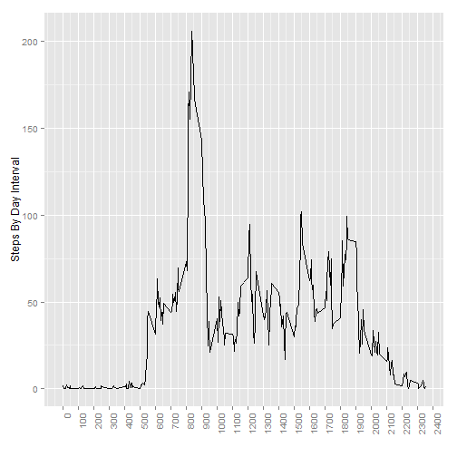
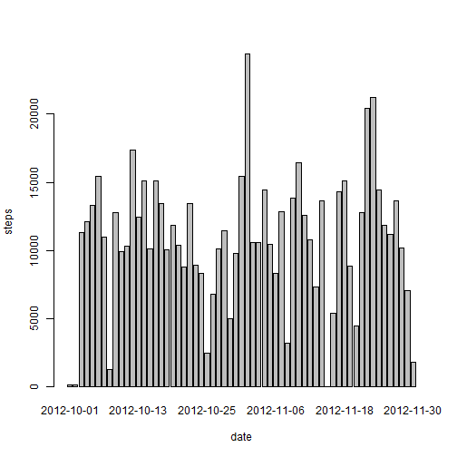
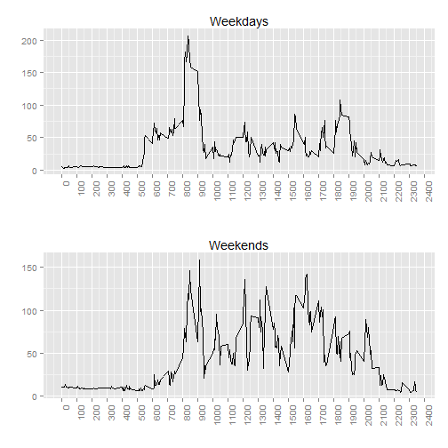

```
## Loading required package: gridExtra
```

```
## Warning: package 'gridExtra' was built under R version 3.1.3
```

## Loading and preprocessing the data


```r
steps <- read.csv("./activity.csv")

summary(steps)
```

```
##      steps                date          interval     
##  Min.   :  0.00   2012-10-01:  288   Min.   :   0.0  
##  1st Qu.:  0.00   2012-10-02:  288   1st Qu.: 588.8  
##  Median :  0.00   2012-10-03:  288   Median :1177.5  
##  Mean   : 37.38   2012-10-04:  288   Mean   :1177.5  
##  3rd Qu.: 12.00   2012-10-05:  288   3rd Qu.:1766.2  
##  Max.   :806.00   2012-10-06:  288   Max.   :2355.0  
##  NA's   :2304     (Other)   :15840
```

## What is mean total number of steps taken per day?

```r
mean_steps<-aggregate(steps$steps,by=list(steps$date),sum )
```
Here is mean of the total number of steps taken per day

```r
mean(mean_steps$x,na.rm = TRUE)
```

```
## [1] 10766.19
```
Here is median of the total number of steps taken per day

```r
median(mean_steps$x,na.rm = TRUE)
```

```
## [1] 10765
```

## What is the average daily activity pattern?

```r
mean_steps_intvl<-aggregate(steps$steps,by=list(interval=steps$interval),mean, na.rm=TRUE )
gr<-qplot(mean_steps_intvl[,1],mean_steps_intvl$x,geom="line",
          ylab = "Steps By Day Interval", xlab="") 
gr<-gr + scale_x_continuous(breaks = seq(0,2400,100)) + theme(axis.text.x = element_text(angle = 90, hjust = 1))
print(gr)
```

 


## Imputing missing values
Number of rows with NA's

```r
nrow(steps[is.na(steps$step), ])
```

```
## [1] 2304
```


```r
steps2<-steps

steps2[is.na(steps2$step), 1]<-merge(steps2[is.na(steps2$step), ], mean_steps_intvl, by="interval")$x
sum_steps<-aggregate(steps2$steps,by=list(date=steps2$date),sum )

barplot(sum_steps$x, names.arg = sum_steps$date, xlab = "date", ylab = "steps")
```

 

Here is mean of the total number of steps taken per day for new dataset

```r
mean(sum_steps$x,na.rm = TRUE)
```

```
## [1] 10766.19
```

Here is median of the total number of steps taken per day for new dataset

```r
median(sum_steps$x,na.rm = TRUE)
```

```
## [1] 11015
```

## Are there differences in activity patterns between weekdays and weekends?

```r
steps2$wd<-weekdays(as.Date(steps2$date),TRUE)
##I have russian language locale here, so all constants below are russsian saturday& sunday
steps2.weekend<-steps2[steps2$wd=='Тё'| steps2$wd=='бс',]
steps2.weekday<-steps2[steps2$wd!='Тё'& steps2$wd!='бс',]

steps2.weekday.mean<-aggregate(steps2.weekday$steps,by=list(interval=steps2.weekday$interval),mean, na.rm=TRUE )
gr.weekday<-qplot(steps2.weekday.mean[,1],steps2.weekday.mean$x,geom="line",
          main = "Weekdays", xlab="", ylab="") 
gr.weekday<-gr.weekday + scale_x_continuous(breaks = seq(0,2400,100)) + theme(axis.text.x = element_text(angle = 90, hjust = 1))


steps2.weekend.mean<-aggregate(steps2.weekend$steps,by=list(interval=steps2.weekend$interval),mean, na.rm=TRUE )
gr.weekend<-qplot(steps2.weekend.mean[,1],steps2.weekend.mean$x,geom="line",
          main = "Weekends", xlab="", ylab="") 
gr.weekend<-gr.weekend + scale_x_continuous(breaks = seq(0,2400,100)) + theme(axis.text.x = element_text(angle = 90, hjust = 1))


grid.arrange(gr.weekday, gr.weekend, nrow=2)
```

 


