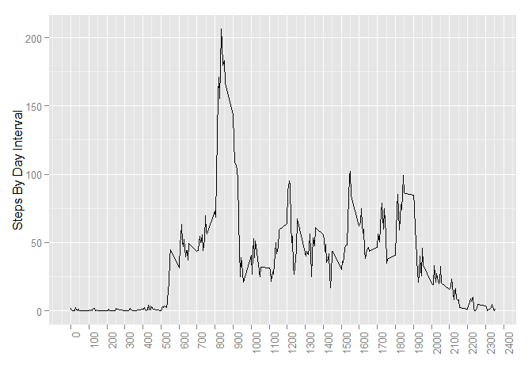
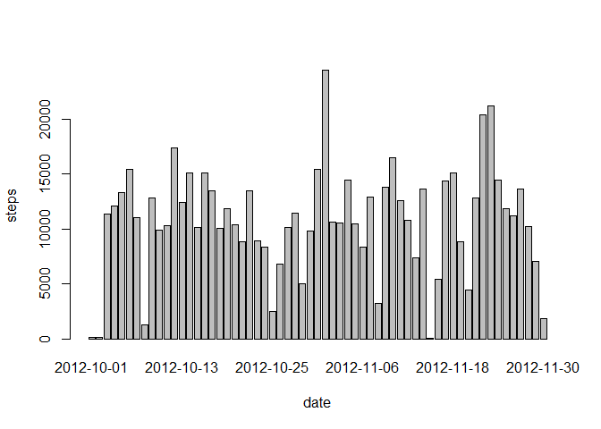

# Reproducible Research: Peer Assessment 1

```
## Loading required package: ggplot2
```

```
## Warning: package 'ggplot2' was built under R version 3.1.3
```

```
## Loading required package: scales
```

```
## Warning: package 'scales' was built under R version 3.1.3
```

## Loading and preprocessing the data


```r
steps <- read.csv("./activity.csv")

summary(steps)
```

```
##      steps                date          interval     
##  Min.   :  0.00   2012-10-01:  288   Min.   :   0.0  
##  1st Qu.:  0.00   2012-10-02:  288   1st Qu.: 588.8  
##  Median :  0.00   2012-10-03:  288   Median :1177.5  
##  Mean   : 37.38   2012-10-04:  288   Mean   :1177.5  
##  3rd Qu.: 12.00   2012-10-05:  288   3rd Qu.:1766.2  
##  Max.   :806.00   2012-10-06:  288   Max.   :2355.0  
##  NA's   :2304     (Other)   :15840
```

## What is mean total number of steps taken per day?

Here is mean of the total number of steps taken per day

```
## [1] 10766.19
```
Here is median of the total number of steps taken per day

```
## [1] 10765
```

## What is the average daily activity pattern?
 


## Imputing missing values
Number of rows with NA's

```
## [1] 2304
```

 
Here is mean of the total number of steps taken per day for new dataset

```
## [1] 10766.19
```
Here is median of the total number of steps taken per day for new dataset

```
## [1] 11015
```

## Are there differences in activity patterns between weekdays and weekends?


